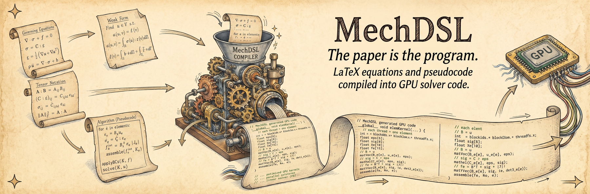

# MechDSL

{ .hero-banner }

**Write your mechanics in LaTeX. Get a tested finite-element solver back.**

MechDSL is a monorepo of LaTeX-to-code compilers for computational solid mechanics. You
describe the math — a boundary-value problem, a strain-energy function, a return-mapping
algorithm — in an ordinary LaTeX document, and the toolchain emits deterministic, tested
[Taichi](https://www.taichi-lang.org/) solver code.

The same `.tex` file renders normally through `pdflatex` **and** is executable input to
the compiler. Your paper's source can be your simulation's source. The guiding principle:

> **Derive models from LaTeX; don't hand-code what the compiler should generate.**

---

## Install it

Everything is on PyPI under the MIT license:

```bash
pip install mechdsl-core              # the compiler: LaTeX -> emitted solver source (Taichi-free)
pip install "mechdsl-core[verify]"    # the full engine: run and verify solves
```

Or skip the scripting entirely and drive it from a browser:

```bash
pip install "mechdsl-workbench[mechdsl]"
mechdsl-workbench                     # then open http://127.0.0.1:8000
```

See [Installation](installation.md) for every package, extra, and the from-source
workflow.

---

## The packages

<div class="grid cards" markdown>

- :material-function-variant: **[mechdsl-core](mechdsl-core/index.md)**

    ---

    The FEM compiler. Turns `% mechanics` directives and strain-energy functions into
    element kernels, deriving stress **S = ∂Ψ/∂E** and tangent **C = ∂²Ψ/∂E²**
    symbolically. Six-layer pipeline, Total Lagrangian, Hex8, Taichi backend.

    `pip install mechdsl-core`

    [:octicons-arrow-right-24: Introduction](mechdsl-core/index.md) ·
    [Getting started](mechdsl-core/getting-started.md)

- :material-cog-transfer: **[algo2code](algo2code/index.md)**

    ---

    The algorithm transpiler. Turns LaTeX `algpseudocode` boxes — return-mapping loops,
    the PCG solver — into executable code. Zero runtime dependencies. Consumed by
    mechdsl-core for everything that *isn't* a closed-form expression.

    `pip install algo2code`

    [:octicons-arrow-right-24: Introduction](algo2code/index.md) ·
    [Getting started](algo2code/getting-started.md)

- :material-chip: **[ti-runtime](ti-runtime/index.md)**

    ---

    The neutral Taichi runtime. Vector primitives, Tier-1 `@ti.func` tensor helpers, and
    the injection seams that generated bodies plug into. Generated code depends on this,
    never on the compiler that produced it.

    `pip install ti-runtime`

    [:octicons-arrow-right-24: Introduction](ti-runtime/index.md)

- :material-application-brackets: **[mechdsl-workbench](workbench.md)**

    ---

    The companion browser app: LaTeX on the left, compiled mechanics or transpiled
    algorithm on the right. Lives in its own repository; the fastest way to try the
    language before committing to the pipeline.

    `pip install "mechdsl-workbench[mechdsl]"`

    [:octicons-arrow-right-24: Browser workbench](workbench.md)

</div>

The three monorepo packages have strict, one-way relationships. **mechdsl-core consumes
algo2code-generated artifacts**; algo2code is runtime-free and never imports `mechdsl`;
`ti-runtime` is what generated code lands on and never imports `mechdsl` either. Together
they cover both halves of a constitutive model — the closed-form energy (differentiated
by mechdsl-core) and the iterative algorithm (transpiled by algo2code) — plus the runtime
floor they both emit against.

---

## A 60-second taste

```python
from mechdsl import compile_latex

source = r"""
% mechanics dim 3
% mechanics cell hex8
% mechanics formulation total_lagrangian
% mechanics material svk --E 200e3 --nu 0.3
% mechanics boundary fix  --type dirichlet --value 0 --components 0 1 2
% mechanics boundary load --type neumann --traction "0 0 -1000"
"""

bundle = compile_latex(source)
print(bundle.element_ir_summary)   # what got localised (element, quadrature, einsum specs)
print(bundle.content_hash())       # deterministic — same input, same hash, every time
```

That call runs the full pipeline: parse the directives → build the Mechanics IR →
localise to an Element IR → plan the tensor contractions → emit Taichi. It needs only the
base `pip install mechdsl-core` — no Taichi required to emit.

---

## Where to go next

- Just want it installed? **[Installation](installation.md)** covers PyPI, the extras,
  and the `uv` source workflow.
- New here? Start with the **[mechdsl-core introduction](mechdsl-core/index.md)** — it's
  the main package.
- Want to run something? **[Getting started](mechdsl-core/getting-started.md)** takes you
  from a fresh install to a compiled solver bundle.
- Prefer clicking to typing? The **[browser workbench](workbench.md)** runs the same
  compiler behind a UI.
- Curious about the design? **[How it works](reference/architecture.md)** is a guided tour
  of the six layers, and the **[FAQ](reference/faq.md)** answers the common questions.
